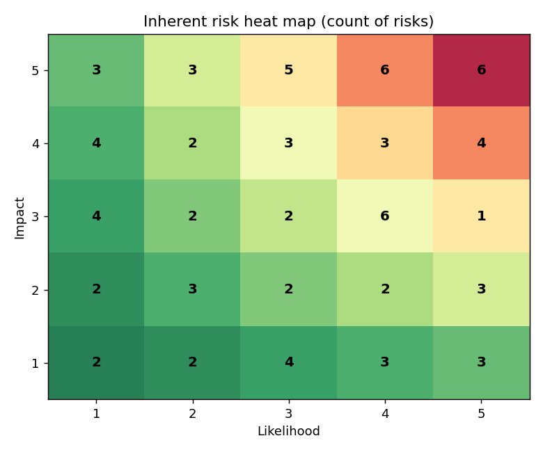
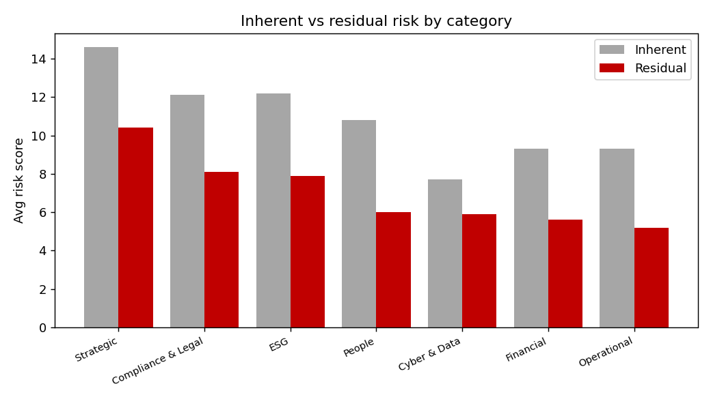

# RiskRegister — Enterprise Risk & Controls Register

A risk-management analysis tool that takes an enterprise risk register and produces
the artefacts a governance / audit committee actually uses: a **5×5 risk heat map**,
an **inherent-vs-residual** view of whether controls are working, a
**control-effectiveness** summary, and a **governance exceptions list**.

Built to practise risk, governance and compliance analysis — the core of risk
advisory work.

> **Scenario:** *Northwind Retail Group* (fictional retailer). Data is **synthetic**,
> generated by `generate_data.py`, scored on a standard 5×5 likelihood × impact model.

## What it does
- **Heat map** — distribution of risks across the 5×5 likelihood/impact grid
- **Inherent vs residual** — by category, showing where controls reduce exposure (and where they don't)
- **Control effectiveness** — Strong / Adequate / Weak mix
- **Governance exceptions** — weak controls over high inherent risks, top residual risks, and reviews overdue >12 months, ready for an audit-committee pack

## Why it's interesting
The interesting bit isn't listing risks — it's the **control logic**. A risk can be
catastrophic on paper but well-controlled (low residual), or look minor but be
unmanaged. This separates "scary-sounding" from "actually needs attention," which is
exactly what risk frameworks (ISO 31000 / three-lines model) are for.

## Tech
Python · pandas · SQLite · matplotlib

## Run it
```bash
pip install -r requirements.txt
python generate_data.py
python analyze.py
```

## Sample output



`outputs/governance_report.md` contains the written exceptions report.

## What I'd do next
- Add Key Risk Indicators (KRIs) with thresholds and trend lines
- Map each risk to specific regulatory clauses for a compliance gap view
- Build an interactive register (add/edit risks) with a Streamlit front end

---
*Synthetic-data portfolio project. Not affiliated with any real company.*
